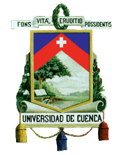
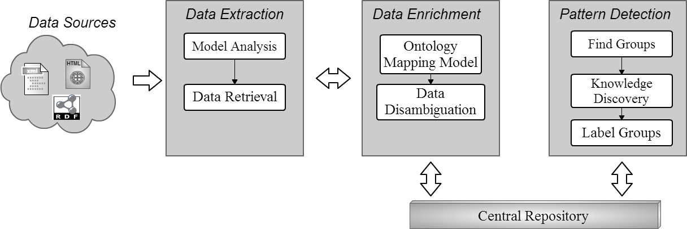

- title : Detecting similar areas of knowledge using Semantic and Data Mining technologies
- description : Thesis presentation in order to obtain the degree of Computer Scientist from the University of Cuenca.
- author : Xavier Sumba
- theme : white
- transition : none

***

### Detecting similar areas of knowledge using Semantic and Data Mining technologies

<i>Detección de areas similares de conocimiento usando tecnologías semánticas y minería de datos.</i>

 
 
##### 
<a style="color: black;" href="http://cuent.tk">Xavier Sumba</a> / <a style="color: black;" href="https://www.facebook.com/FERNANDO2654?fref=ts">Freddy Sumba</a>

<i>Universidad de Cuenca, Departamento de Ciencias de la Computación, Cuenca, Ecuador.</i>

***

### Introducción

- ¿Quién trabaja en líneas de investigación parecidas?
- ¿Cómo se puede crear una red de investigadores de un área en común, cuando no conocemos si estas existen?
- Obtener sus artículos, conocer revistas en las que fueron aceptados, entre otros.

***

### Problemas comunes

***

### Arquitectura General

---

### Data Sources

#### Fuentes de datos bibliográficas

Las fuentes utilizadas, contienen información de investigadores y publicaciones científicas. Abarcan diferentes dominios de estudio, por lo que la estructura de los datos varían por cada fuente. Algunas fuentes proveen APIs que permiten la extracción de datos, sin embargo se tienen limitaciones de cuota.

---

### Data Extraction

El modulo de extracción de datos se encarga de obtener y describir datos bibliográficos desde varias fuentes, utilizando tecnologías semánticas y principios de Linked Data.

El modelo de datos de la fuente es mapeado a un modelo común basado en la ontología BIBO.

---

### Data Extraction

Datos extraidos

---

- class : withbackground

**Ejemplo de diferencia entre atributos de DBLP y el modelo de datos común.**

<table style="font-size: large;">
<thead>
<tr class="header">
<th>
DBLP fields
</th>
<th>
Common model fields
</th>
</tr>
</thead>
<tbody>
<tr class="odd">
<td>
dblp:primaryElectronicEdition
</td>
<td>
bibo:uri
</td>
</tr>
<tr class="even">
<td>
dblp:publishedAsPartOf
</td>
<td>
dc:isPartOf
</td>
</tr>
<tr class="odd">
<td>
dblp:publishedInBook
</td>
<td>
dc:publisher
</td>
</tr>
<tr class="even">
<td>
dblp:authoredBy
</td>
<td>
dc:contributor
</td>
</tr>
<tr class="odd">
<td>
dblp:title
</td>
<td>
dc:title
</td>
</tr>
<tr class="even">
<td>
dblp:pageNumbers
</td>
<td>
bibo:numPages
</td>
</tr>
</tbody>
</table>

' | DBLP fields                   | Common model fields |
' |-------------------------------|---------------------|
' | dblp:primaryElectronicEdition | bibo:uri            |
' | dblp:publishedAsPartOf        | dc:isPartOf         |
' | dblp:publishedInBook          | dc:publisher        |
' | dblp:authoredBy               | dc:contributor      |
' | dblp:title                    | dc:title            |
' | dblp:pageNumbers              | bibo:numPages       |

---

### Data Enrichment
#### Modelo de datos

El modelo de datos basado en la ontología BIBO.

---

### Data Enrichment
#### Mapeo del modelo de datos

El modelo de datos de cada fuente es diferente, por lo cual se realiza un mapeo de la fuente al modelo de datos común y se almacena en el repositorio central.

---

### Data Enrichment
#### Desambiguación de información.

Debido a que se obtiene datos de diferentes fuentes bibliogríficas se tiene datos incoherentes o duplicados. Por lo que es necesario utilizar técnicas de desambiguación, en autores y publicaciones.

---

### Data Enrichment
#### Desambiguación de información.

---

### Data Enrichment
#### Desambiguación de información.

Indice de similaridad entre recursos bibliográfico.

---

### Pattern Detection
#### Proceso para detección de areas y redes de colaboración

Find groups detectar patrones de los datos almacenados en el repositorio central.

Knowledge Discovery asociar patrones a un formato legible por un humano. Se descubre redes de colaboración y áreas de
conocimiento.

Label Groups Se encuentra una etiqueta a cada cluster, ayuda a acelerar consultar y mantener la información
organizada en el repositorio.

---

### Find Groups

---

### Knowledge Discovery

<table style="width:100%">
  <tr>
    <th style="width: 30%; vertical-align: middle;"></th>
    <th class="fragment" style="width: 70%"></th>
  </tr>
</table>

---

# Topic Model + WordNet

# =
# Label

---
### Topic Model

[Imagen de *David M. Blei* - Probabilistic Topic Models ](http://www.cs.princeton.edu/~blei/kdd-tutorial.pdf)

' Frecuencia Distribución de palabras/topicos
' Numero de topicos
' Varios documentos a varios topicos

---

### Label Groups

---

### Datos listos para ser explotados

---

### Resultados

---

---

<table style="width:100%">
  <tr>
    <th style="width: 35%; vertical-align: middle;">
      <h4 style="text-align: center">Areas Relevantes</h4>
      
    </th>
    <th class="fragment" style="width: 65%">
      <h4>Areas de colaboración</h4>
      
    </th>
  </tr>
</table>

---

# __¿Más?__

***

### Conclusiones

- Resultados están acorde a lo esperado, sin embargo, procesos como el de desambiguación y etiquetado necesitan un trabajo mas exhaustivo, debido a que aun se tienen ciertas inconsistencias en los resultados.
- Considerar que incluso para una persona es complicado determinar cierta información sobre un investigador o varios investigadores que pueden trabajar en conjunto. Por lo que aun es un reto a nivel computacional.
- Además como resultado se cuenta con un repositorio centralizado y se provee el uso de estos datos a cualquier persona.

***

### Trabajos Futuros

- Incluir el abstract para analizar redes de colaboración.
- Mejorar el proceso de etiquetado.
- Analizar nuevos algoritmos de clustering o otras técnicas para encontrar agrupaciones.

***

<table style="width:100%;">
  <tr>
    <th><h2 style="text-align: center">CLEI 2016</h2></th>
    <th><h2 style="text-align: center">ENTCS</h2></th>
    <th><h2 style="text-align: center">TICAL</h2></th>
  </tr>
  <tr>
    <th style="width: 33%; vertical-align: middle;">
      
    </th>
    <th style="width: 33%; text-align:center; vertical-align: middle;">
      
    </th>
    <th style="width: 33%; text-align:center; vertical-align: middle;">
      
    </th>
  </tr>
</table>

***

Agradecemos a **CEDIA** por el apoyo brindado durante el transcurso de está investigación.

***

# ¿PREGUNTAS?
